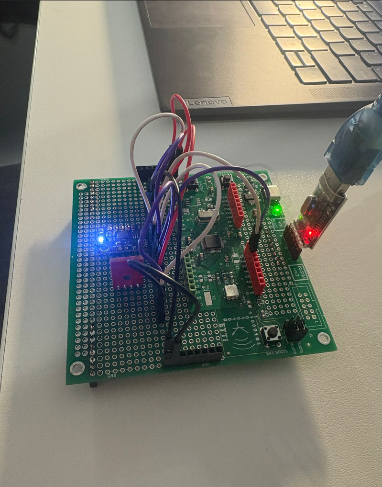
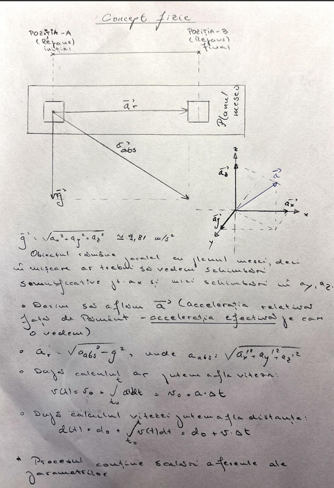
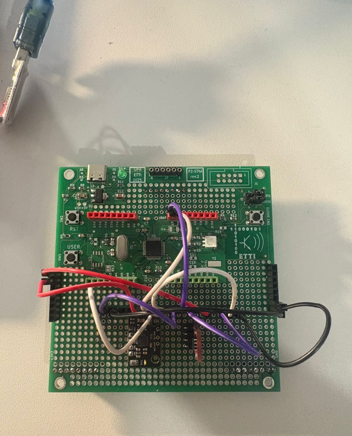
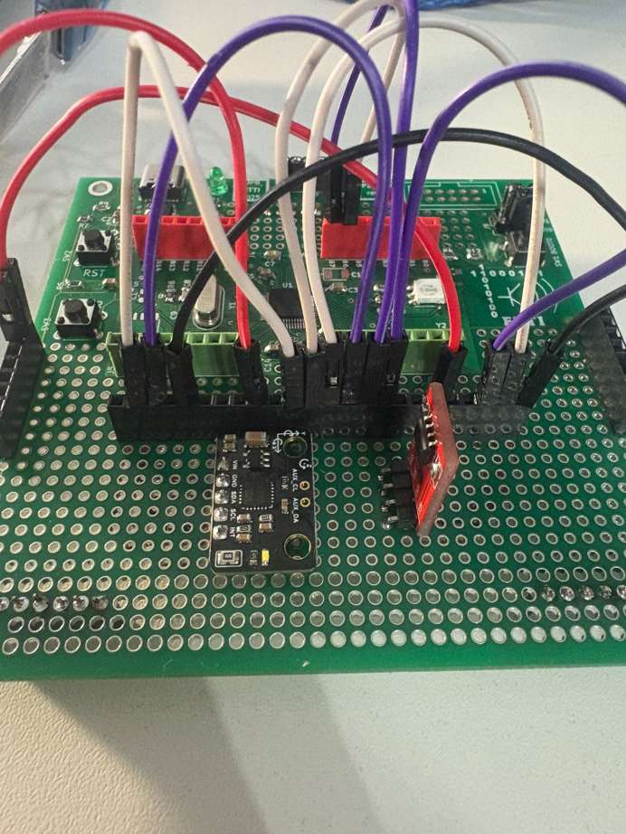
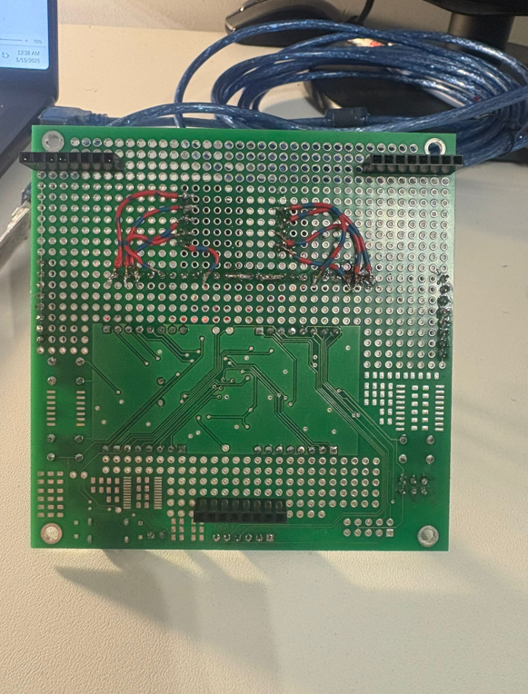
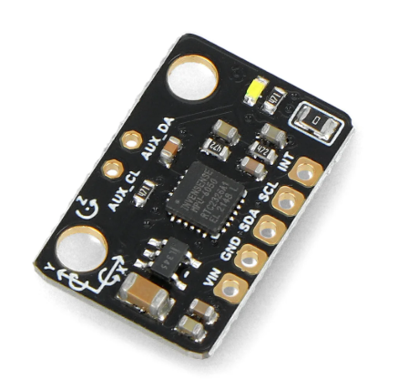
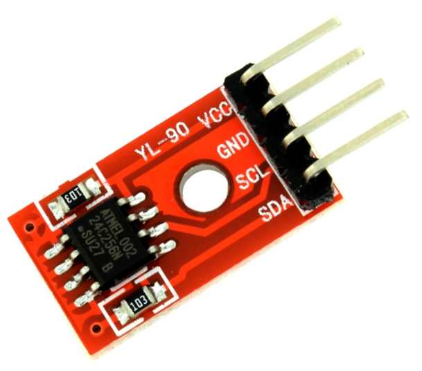
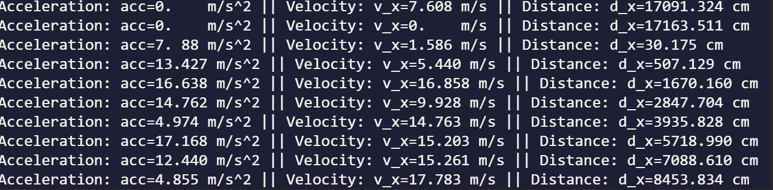

# STM32 Digital Gyroscope & Accelerometer Logger

## Overview
This firmware turns an STM32-based custom PCB into a **motion‑data logger**.  
It samples a **MPU‑6050** IMU every **100 ms**, computes per‑axis **acceleration, velocity, and displacement** over the last second, and streams the results to a PC **HyperTerminal** session.  
A rolling history of **20 samples** is preserved in an external **AT24C256 I²C EEPROM** and dumped to the terminal every 10 s so you can watch the data scroll as new measurements arrive.

---

## 📸 Project Concept (Hardware)

  
*Photo of the custom PCB with STM32, MPU6050, and EEPROM mounted.*

---

## 📐 Physical Principles

 
*Photo illustrating the physics principles behind the project.*

---

## 🔌 Wiring Diagram

 
 
 

*Image showing how components are physically connected: STM32 ↔ MPU6050 ↔ EEPROM, with power lines and I²C/UART.*

---

## Hardware

| Block | Part | Notes |
|-------|------|-------|
| Microcontroller | *STM32F1 series* (tested with **STM32F103C8**) | 72 MHz, 3.3 V |
| IMU | **MPU‑6050** | 3‑axis gyro + 3‑axis accel |
| External EEPROM | **AT24C256** | 32 KB, I²C @ 400 kHz |
| USB‑UART bridge | CH340 / FT232 / ST‑Link VCP | Any 3.3 V‑logic adapter |
| Power | 5 V via USB or 3.3 V regulator | ~20 mA typical |

 
MPU6050 Accelerometer and Gyroscope
 
Two-wire Serial EEPROM AT24C256

### I²C Pin‑out (default)

| Signal | STM32 pin | Pull‑ups |
|--------|-----------|----------|
| **SCL** | PB6 | 4.7 kΩ to 3.3 V |
| **SDA** | PB7 | 4.7 kΩ to 3.3 V |

### UART

* **Port:** USART1  
* **Pins:** PA9 (TX) / PA10 (RX)  
* **Baud:** 115 200 8N1

---

## 🔍 How It Works – Data Flow

1. **Sampling**  
   Every 100 ms, the MPU6050 is polled via I²C to read raw acceleration data (x, y, z axes).  
   These values are stored in a **rolling buffer of 20 samples** in RAM.

2. **Computation**  
   Once per second:
   - Velocity is computed by numerical **integration of acceleration** over the last 10 samples.
   - Displacement is calculated by **integrating velocity**.
   - These computed values are formatted and sent via UART to HyperTerminal.
   - The full buffer is also **written to EEPROM** (one second = 10 samples × 100 ms).

3. **EEPROM Logging**  
   Every 10 seconds:
   - The full EEPROM is **dumped to UART**.
   - This allows the user to view how the stored buffer scrolls and updates.

4. **Fixed-point math** is used throughout to avoid floating point overhead on STM32.

---

## 🧠 Firmware Architecture

```
Core/
 ├─ Inc/            ── Application headers
 ├─ Src/
 │   ├─ main.c      ── Super‑loop & high‑level tasks
 │   ├─ mpu6050.c   ── IMU driver (I²C HAL)
 │   ├─ at24cxx.c   ── EEPROM driver (I²C HAL)
 │   └─ utils.c     ── Fixed‑point math, helpers
 └─ ...
```

---

## 🖼️ Example Output (UART)

 

## Building & Flashing

1. **Clone** or unzip this repo.  
2. Open `Test1` with **STM32CubeIDE ≥ 1.15**.  
3. Select the correct MCU/board under *Project → Properties → C/C++ Build → Settings*.  
4. **Build** (`Ctrl +B`).  
5. Connect an **ST‑Link V2** and click **Run → Debug** or use `make flash`.

> A `Makefile` is also provided for CLI users (`arm-none-eabi-gcc`, `openocd`).

---

## Calibration

Before first use run:

```text
$ python tools/calibrate.py             # optional helper script
```

and update the offsets in `mpu6050.c`.

---

## Extending

* Port to other STM32 families by regenerating HAL drivers.
* Switch to **DMA + low‑power** for sampling.
* Replace HyperTerminal dump with a **binary CSV** logger.

---

## License

MIT – see `LICENSE` for details.

---

© 2025 Noris Vladislav. Feel free to reach out for questions or improvements!
